# Dossier d'étude du projet de création d'un suivit des taches et facturations.

## Réception et étude du CDC -> préparation d'un format merise, d'une maquette et d'un nouveau cdc

## Base de travail : Wareframe basique type Symfony (Game Catalog) et le merise étudié

--> Récupération de la base du Wareframe de Game Catalogue  
--> Réflexion sur la base de donnée créé --> évolution durant la préparation des CRUD  
|--> allez voir le fichier Bakend/config/CREATE_BDD.sql.

## Répartition des tâches

-> Travaux sur les CRUD

--> Laetitia sur les utilisateurs
--> Mattéo sur les Taches
--> Xavier sur les entreprises

### ETUDE CRUD UTILISATEUR

-> lors du choix de faire une page en js pour faire un modal en JS :  
-> read créé  
-> erreur lors de la création avec le modal.  

#### PLAN D'ORGANISATION DES FICHIERS

Structure actuelle de votre projet :
```
rahinsoo/G2-P25-111801-fil_rouge-D10/  
├── config/  
│   ├── db.php  
│   ├── db.local.php  
│   ├── routes.php  
│   └── CREATE_BDD.sql  
├── public/  
│   ├── assets/  
│   │   └── modal.css  
│   │   └── styles.css  
│   ├── img/  
│   │   └── DATAPUNCH.png  
│   └── index.php  
│   └── JS  
│       └── modal.js  
├── src/  
│   ├── Controller/  
│   │   ├── AppController.php  
│   │   └── UserController.php  
│   ├── Core/  
│   │   ├── Cors.php  
│   │   ├── Database.php  
│   │   ├── Request.php  
│   │   ├── Response.php  
│   │   ├── Router.php  
│   │   └── Session.php  
│   ├── Helper/  
│   │   └── Debug.php
│   ├── Model/  
│   │   ├── Home.php  
│   │   └── User.php  
│   └── Repository/  
│       ├── CustomerRepository.php  
│       ├── HomeRepository.php  
│       ├── RoleRepository.php  
│       └── UserRepository.php  
├── views/  
│   ├── pages/  
│   │   ├── customer/  
│   │   │   └── listCustomer.php  
│   │   ├── home. php  
│   │   ├── games. php  
│   │   ├── add. php  
│   │   ├── detail.php    
│   │   └── not-found.php  
│   └── partials/  
│       ├── header.php  
│       └── footer.php  
├── scripts/  
├── autoload.php  
└── docker-compose.yml  
```

### PULL REQUEST CRUD UTILISATEUR puis avec CRUD ENTREPRISE

De base, la connection est en dehors du front initial :  
-> le but :  
--> faire fonctionner la base client sur un autre PC  
--> Lié la partie connection avec la partie Home initial si oui ou non connecté.  
--> validation des CRUD

Choix de la fusion des 2 CRUD et intégration au views :  
#### Schéma du flux de connexion

```
┌─────────────────┐  
│   / ou /login   │  ← Page d'entrée  
└────────┬────────┘  
         │  
         ▼  
┌─────────────────────────┐  
│  AuthController:: login │  Affiche views/pages/auth/login.php  
└────────┬────────────────┘  
         │ POST /login  
         ▼  
┌──────────────────────────────┐  
│ AuthController::authenticate │  Vérifie les identifiants  
└────────┬─────────────────────┘  
         │  
         ├─── ❌ Échec → Redirect /login (avec message d'erreur)  
         │  
         └─── ✅ Succès → Redirect /dashboard  
         │  
         ▼  
┌──────────────────────────┐  
│ DashboardController      │  
│ :: index()               │  
│                          │  
│ Vérifie isLogged()       │  
│                          │  
│ Affiche:                 │  
│ views/pages/dashboard/   │  
│ index.php                │  
└──────────────────────────┘  
```

#### FLUX DE NAVIGATION FINAL

```
┌─────────────────────┐  
│   Utilisateur       │  
│   visite "/"        │  
└──────────┬──────────┘  
           │  
     ┌─────▼─────┐  
     │ Connecté ?│  
     └─────┬─────┘  
           │  
    ┌──────┴──────┐
    │             │  
   NON           OUI  
    │             │  
    ▼             ▼  
┌────────────┐  ┌──────────┐  
│ /connection│  │  /home   │  
│            │  │          │  
│ Formulaire │  │ +header  │  
│   login    │  │  + liens │  
└────┬───────┘  └────┬─────┘  
     │               │  
     │ POST /login   │  
     └───────►┌──────▼──────┐  
              │ Authentifié │  
              └──────┬──────┘  
                     │  
                     ▼  
                ┌──────────┐  
                │  /home   │  
                └──────────┘ 
```


### Finalisation CRUD ENTREPRISE et Une partie du design

Design par "cases" : 

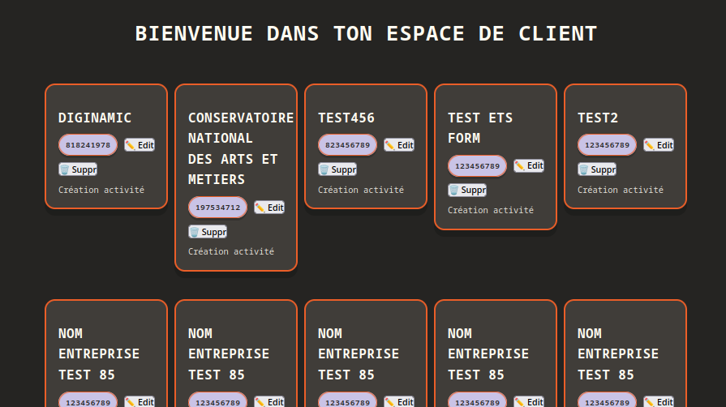
Modification du design sur certaines parties.
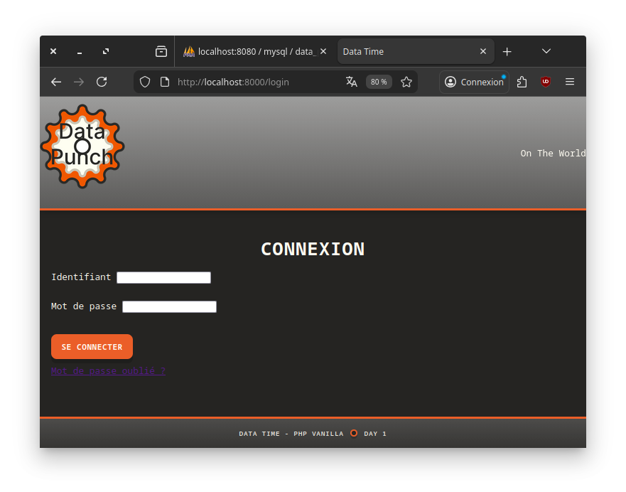
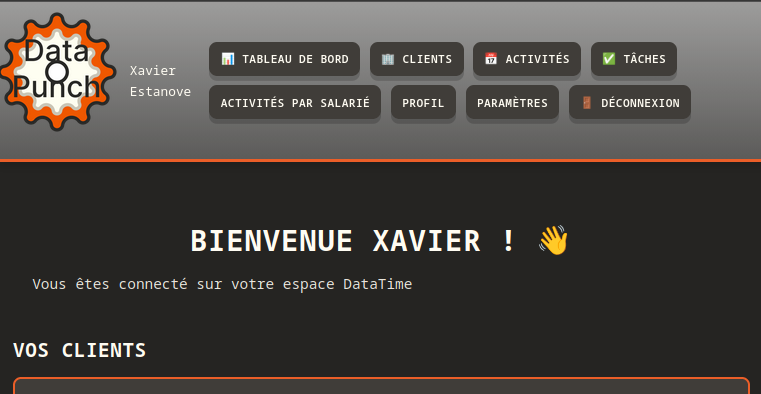

Création de l'espace de travail du crud
- read -> lecture dans "home" et dans "client"
  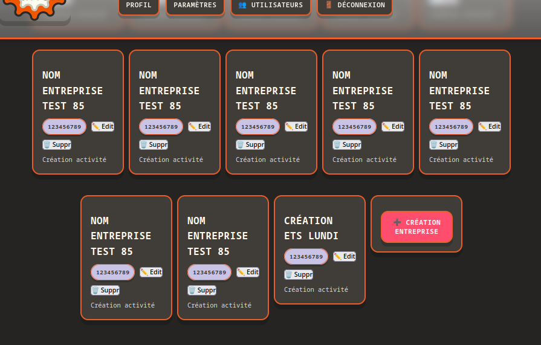
- delete -> bouton de suppression dans chaque carte client.
  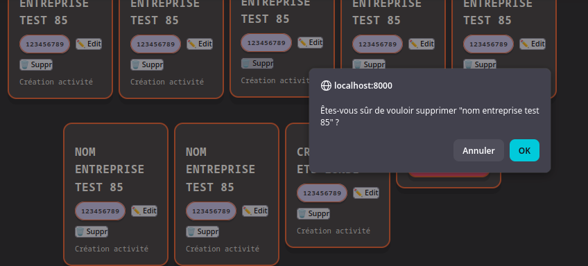
#### Important -> utilisation de JS pour utiliser une modale pour la création et la modification.

- create -> bouton pour la création -> affichage des données à créer
  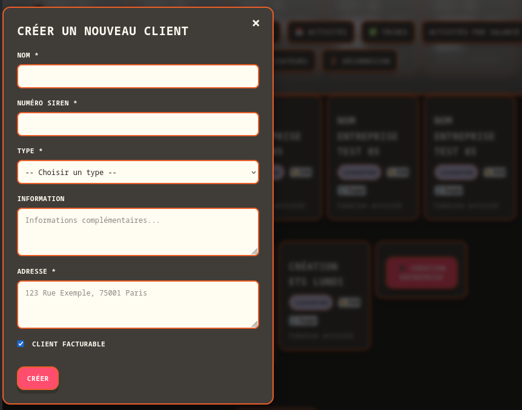
- update -> bouton dans chaque carte client -> insertion de l'affichage de la BDD possibilité de la modifier en totalité.
  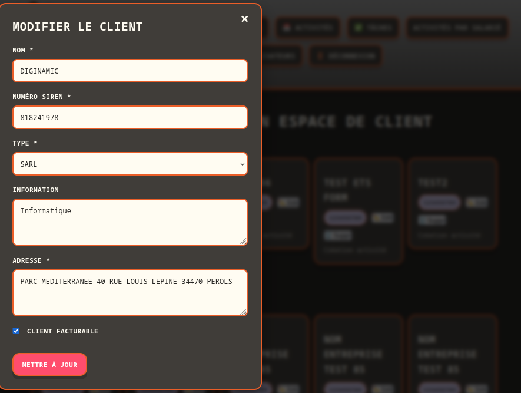


#### Préparation de l'utilisation de l'api SIREN

Création du compte à mon nom pour cette application Data Punch
Connection API - SIREN  
curl --header "X-INSEE-Api-Key-Integration: f03b71b1-35dc-4291-bb71-b135dcd2911a" \
https://api.insee.fr/api-sirene/3.11

Test Postman :  
https://api.insee.fr/api-sirene/3.11/siren/{siren}  
|-> permet d'avoir le nom de l'ets  
https://api.insee.fr/api-sirene/3.11/siret/{siret}  
|-> permet d'avoir le nom de l'ets et surtout son adresse

Image avec le siren de Diginamic (GET) :
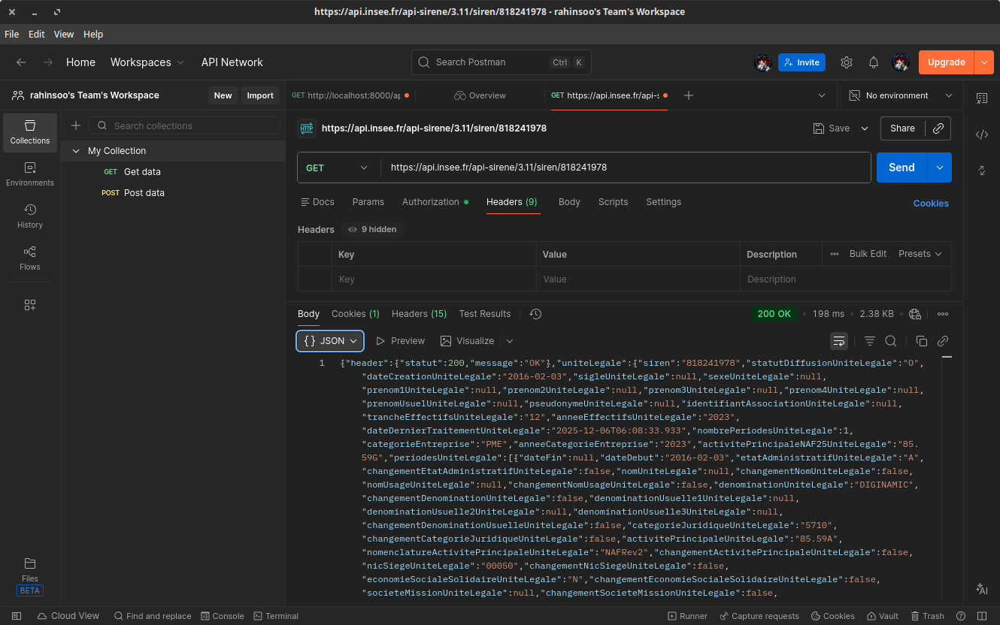

--> pour mettre l'adresse --> utiliser le siret.  
|--> par exemple siret Diginamic sur Montpellier = 81824197800050  
|--> et Diginamic sur Nante = 81824197800035  

Image avec le siret de Diginamic (de Nantes) (GET) :
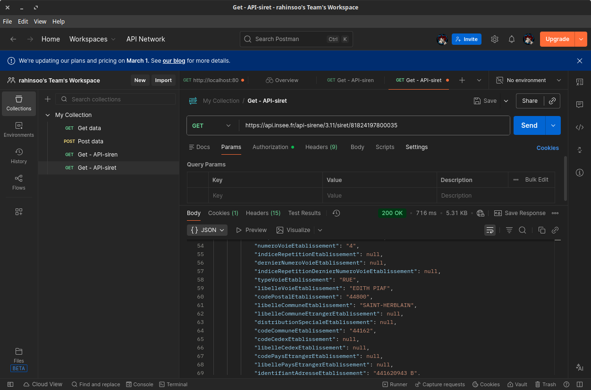

Pour Utiliser L'API-siren et réccupérer les informations que l'on a besoin :  
-> Validation du numéro de siret  
-> nom de l'entreprise lié
-> information de l'adresse lié  

## Objectif

Intégrer l'auto-complétion des informations d'entreprise (nom et adresse) via l'API SIRENE de l'INSEE lorsque l'utilisateur saisit un numéro SIRET dans la modal de création/édition de client.
```
┌─────────────────────────────────┐
│ Nom *                           │
│ [DIGINAMIC_________________]    │ ← ✨ Auto-rempli
│                                 │
│ Numéro SIRET *                  │
│ [81824197800035] 🔍             │ ← Saisie + loader
│ ✅ Entreprise trouvée: DIGINAMIC│ ← Feedback
│                                 │
│ Adresse *                       │
│ [4 RUE EDITH PIAF 44800...]     │ ← ✨ Auto-rempli
└─────────────────────────────────┘
```

## Contexte

Actuellement, la modal de création et d'édition de client (`views/pages/customer/listCustomer.php` et `public/js/modal.js`) demande à l'utilisateur de saisir manuellement :
- Le nom de l'entreprise
- Le numéro SIRET
- L'adresse

L'API SIRENE de l'INSEE permet de récupérer automatiquement ces informations à partir du SIRET.

### Exemple de réponse API

Endpoint : `https://api.insee.fr/api-sirene/3.11/siret/81824197800035`

Réponse attendue (extrait) :
```json
{
    "etablissement": {
        "siret": "81824197800035",
        "uniteLegale": {
            "denominationUniteLegale": "DIGINAMIC"
        },
        "adresseEtablissement": {
            "numeroVoieEtablissement": "4",
            "typeVoieEtablissement": "RUE",
            "libelleVoieEtablissement": "EDITH PIAF",
            "codePostalEtablissement": "44800",
            "libelleCommuneEtablissement": "SAINT-HERBLAIN"
        }
    }
}
```
## Modifications à apporter

### 1. Modifier le formulaire HTML (`views/pages/customer/listCustomer.php`)

- **Changer le champ `numero_SIREN`** pour `numero_SIRET` avec pattern de 14 chiffres
- **Ajouter des éléments visuels** :
  - Loader/spinner pendant la requête API
  - Message d'erreur en cas d'échec
  - Message de succès avec le nom de l'entreprise trouvée
- **Ajouter un placeholder** explicite (ex: "81824197800035")

### 2. Mettre à jour le JavaScript (`public/js/modal.js`)

Ajouter les fonctionnalités suivantes :

#### a) Configuration API --> mis à la place dans un fichier SireneApi
```php
// notre clé de l'api lié à mon compte (création d'un compte gratuite)
$apiKey = "f03b71b1-35dc-4291-bb71-b135dcd2911a";
// url de recherche du siret client
$url = "https://api.insee.fr/api-sirene/3.11/siret/{$siretClean}";
// option en header pour pouvoir utiliser l'url de recherche ci-dessus
$options = [
  'http' => [
  "method" => "GET",
        "header" =>
"Accept: application/json;charset=utf-8;qs=1\r\n" .
"X-INSEE-Api-Key-Integration: $apiKey\r\n"
]
];
```
Le fichier SirenApiController : 
```
├── src/  
│   ├── Controller/ 
│   │        └── API/
│   │             └── SireneApiController.php  
│   ├── Core/  
│   ├── Helper/  
│   ├── Model/  
│   └── Repository/  
```
Création de la route :  
```php
$router->get('/api/sirene/siret/(\d+)', function($matches) use ($sireneApiController) {
        $sireneApiController->rechercherSiret($matches[1]);
    });
```
--> rechercherSiret -> est la fonction dans SirenApiController.  

#### b) Fonction `fetchSiretData(siret)`
- Valider le format SIRET (14 chiffres)
- Appeler l'API INSEE avec le token Bearer
- Gérer les erreurs (404, 401, etc.)
- Retourner un objet avec `nom`, `adresse`, `siret`

#### c) Fonction `formatAdresse(adresseObj)`
- Construire une adresse lisible à partir des champs de l'API :
  - `numeroVoieEtablissement`
  - `typeVoieEtablissement`
  - `libelleVoieEtablissement`
  - `codePostalEtablissement`
  - `libelleCommuneEtablissement`
- Exemple : "4 RUE EDITH PIAF 44800 SAINT-HERBLAIN"

#### d) Écouteur d'événement `input` sur le champ SIRET
- **Debounce de 800ms** pour éviter les appels excessifs
- Déclencher la recherche automatiquement quand 14 chiffres sont saisis
- Auto-remplir les champs `nom` et `adresse`
- Afficher un feedback visuel (succès/erreur)

### 3. Ajouter des styles CSS (`public/assets/modal.css`)

```css
/* Loader animé */
.loader {
    display: inline-block;
    margin-left: 8px;
    animation: spin 1s linear infinite;
}

@keyframes spin {
    from { transform: rotate(0deg); }
    to { transform: rotate(360deg); }
}

/* Messages d'erreur/succès */
small {
    display: block;
    margin-top: 4px;
    font-size: 13px;
}
```

### 4. Mettre à jour la base de données (si nécessaire)

Le champ `numero_SIRET` dans la table `ENTREPRISE` doit accepter **14 chiffres** (actuellement INT, à vérifier).

Suggestion : utiliser `BIGINT` pour éviter les problèmes de dépassement.

```sql
ALTER TABLE ENTREPRISE MODIFY COLUMN numero_SIRET BIGINT;
```

## Critères d'acceptation

- ✅ Le champ SIRET accepte exactement 14 chiffres
- ✅ Lorsque l'utilisateur saisit un SIRET valide, les champs `nom` et `adresse` se remplissent automatiquement
- ✅ Un loader s'affiche pendant la requête API
- ✅ Un message de succès s'affiche avec le nom de l'entreprise trouvée
- ❌ Un message d'erreur s'affiche si le SIRET n'existe pas ou si l'API échoue
  - le message d'erreur ne s'affiche pas --> à vérifier.
- ✅ L'auto-complétion fonctionne en mode création ET édition
- ✅ L'utilisateur peut toujours modifier manuellement les champs pré-remplis
- ✅ Le code est commenté en français

Test de création Diginamic (de Nantes) avec sont siret (GET) :
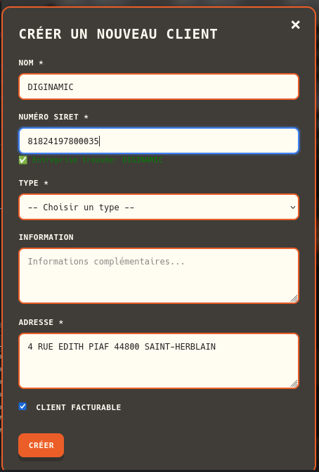

Test modification d'un client avec le siret de Diginamic (de Nantes), j'ai modifié le titre :
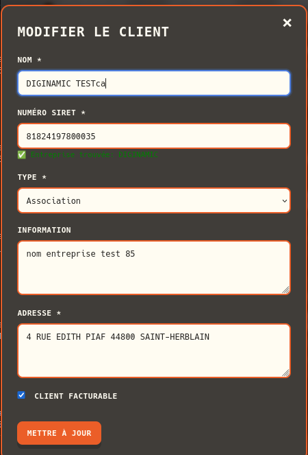  
Les infos du nom et adresse se sont mis automatiquement à jour

### PULL REQUEST CRUD ENTREPRISE -> de la branche client_crud-V2

